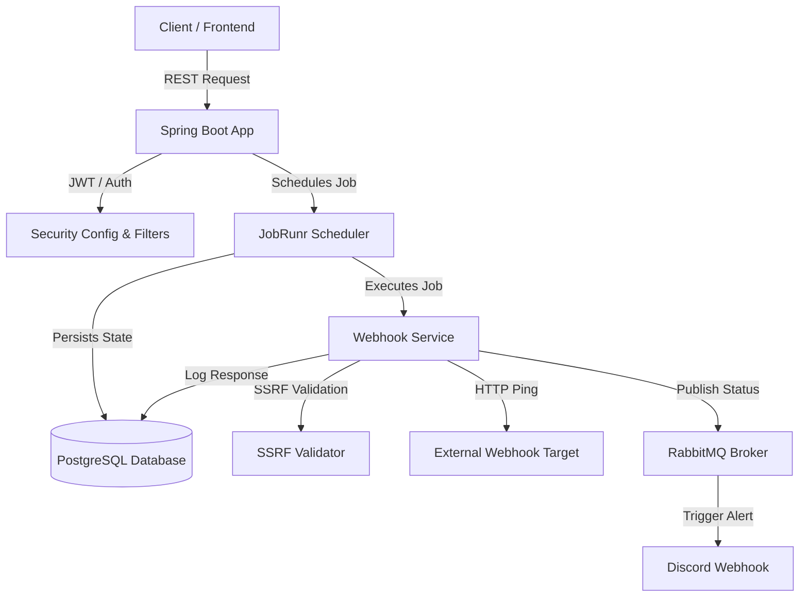

# Berry 🍓

a simple cron job engine helped me learn core parts of springboot and java. i wanted this project to help me learn distributed systems and how to design a system to handle real traffic. but since i had restrictions of spending no money on this, i decided to deploy everything on render's free tier. 

berry is a lightweight, distributed cron job and webhook scheduler. it lets you schedule recurring HTTP pings, print logs, and get notified on discord when things fail or succeed. 

---

## 🏗️ Architecture

here's how everything connects. since we are on render's free tier, we avoided resource-heavy message brokers or caching layers (like redis) and instead utilized postgres as our single source of truth for scheduling and job states via jobrunr.



---

## ⚡ Quick Start (Local Setup)

to run this locally without spending a dime:

1. **Clone the repo**
2. **Setup your `.env` file** in the root directory:
   ```env
   DB_USERNAME=postgres
   DB_PASSWORD=your_db_password
   JWT_SECRET=your_super_secret_jwt_key_must_be_32_chars_long
   RABBITMQ_HOST=localhost
   RABBITMQ_PORT=5672
   GOOGLE_CLIENT_ID=optional-for-oauth
   GOOGLE_CLIENT_SECRET=optional-for-oauth
   APP_ENV=dev
   ```
3. **Start the app:**
   ```bash
   ./mvnw spring-boot:run
   ```
   *the app will spin up on port `8080`.*

---

## 🔌 API Reference

### 🔐 Authentication (`/api/auth`)
| Endpoint | Method | Description | Auth Required |
| :--- | :--- | :--- | :--- |
| `/api/auth/signup` | POST | register a new user | No |
| `/api/auth/login` | POST | log in and receive `auth_token` cookie | No |
| `/api/auth/logout` | POST | clear the `auth_token` cookie | Yes |

### 📅 Job Management (`/api/jobs`)
| Endpoint | Method | Description | Auth Required |
| :--- | :--- | :--- | :--- |
| `/api/jobs/create` | POST | schedule a new cron job (webhook or log) | Yes |
| `/api/jobs` | GET | list all jobs owned by you | Yes |
| `/api/jobs/{secureJobId}` | DELETE | delete a specific job | Yes |
| `/api/jobs/{secureJobId}/details` | GET | get metadata and next execution time | Yes |
| `/api/jobs/{secureJobId}/history` | GET | get last 100 runs of the job from jobrunr | Yes |
| `/api/jobs/{secureJobId}/responses` | GET | get raw HTTP response logs from webhook pings | Yes |
| `/api/jobs/{secureJobId}/settings` | PATCH | update notification preferences | Yes |

### 🔔 Notification Channels (`/api/notifications/channels`)
| Endpoint | Method | Description | Auth Required |
| :--- | :--- | :--- | :--- |
| `/api/notifications/channels` | GET | list all registered notification channels | Yes |
| `/api/notifications/channels` | POST | add a new channel (e.g., discord webhook) | Yes |
| `/api/notifications/channels/{id}` | DELETE | remove a notification channel | Yes |

---

## 📚 Deep Dives & Documentation

want to know the math or how we secured it? check out the guides below:

* **[Capacity & Bottlenecks (The Math)](docs/architecture.md)** — how much traffic this free-tier monster can actually handle.
* **[Security Architecture](docs/security.md)** — how we blocked SSRF, CSRF, and BOLA on a zero-dollar budget.
