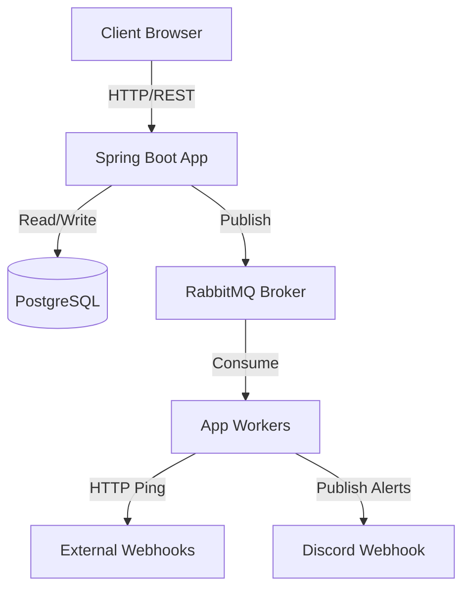

# Capacity Planning & Hardware Bottlenecks

building a distributed scheduler on a zero-dollar budget is all about managing tight limits. since we are running everything on **render's free tier**, we have to work with some harsh hardware bottlenecks:

*   **RAM:** 512 MB (hard limit, the container will instantly OOM and crash if we exceed this).
*   **CPU:** 0.1 CPU share (shared dynamically, meaning CPU-heavy tasks will throttle us).
*   **Postgres Connections:** neon/supabase/render free tiers usually limit us to 10–50 concurrent connections.

here is the engineering math behind how we tuned the system to stay alive under real traffic without crashing our free hosting.

---

## System Architecture



## Throughput & Scaling (Powered by Virtual Threads)

if we assume our RabbitMQ message broker has unlimited throughput and zero latency, the system's capacity is entirely bottlenecked by the application's worker threads on Render's free tier. 

traditionally, java threads are tied 1:1 to OS threads. on 512MB RAM, running more than 150-200 platform threads will crash the container with an OutOfMemoryError. 

however, because our webhook pings are entirely **I/O bound** (waiting 500ms for network responses) rather than CPU bound, we upgraded the system to use **Java 21 Virtual Threads**.

### Webhook Execution Capacity
a virtual thread consumes a negligible ~1KB of heap memory and unmounts from the underlying CPU while waiting for the network. this allows us to scale our `JobRunr` workers to **200** without hitting memory limits or throttling the 0.1 vCPU.

$$\text{Throughput per worker} = \frac{1000\text{ ms}}{500\text{ ms/job}} = 2\text{ jobs/sec}$$

$$\text{Max System Throughput} = 200\text{ workers} \times 2\text{ jobs/sec} = 400\text{ jobs/sec}$$

*   **per minute:** $400 \times 60 = 24,000\text{ jobs/minute}$.
*   **per day:** $24,000 \times 1440 = 34,560,000\text{ jobs/day}$.

thanks to virtual threads, our free-tier container can theoretically trigger **34.5 million webhooks a day**.

### 2. Discord Notification Overhead
what if every job triggers a discord webhook notification? 
a discord webhook ping also takes ~500ms to complete. because Spring Boot 3.2+ backs `@RabbitListener` with virtual threads, we safely increased the concurrency limit to **20**.

$$\text{Notification Throughput} = 20\text{ workers} \times 2\text{ pings/sec} = 40\text{ notifications/sec}$$

if 100% of the 400 jobs/sec trigger notifications, the queue will back up because the consumer (40/sec) cannot keep up with the producer. to maintain a 100% notification rate at max capacity, we would just bump the rabbitmq concurrency to 200 (which costs negligible memory), bringing the system to a perfectly balanced 34.5 million jobs + 34.5 million notifications per day.

### 3. The Slow Target Bottleneck (Tarpits)
what if a user configures a job to ping a slow server that takes **4 seconds** to respond? 
if we used platform threads, 10 slow jobs would block the whole pool. with 200 virtual threads, 10 tarpit jobs barely make a dent. additionally, we configured our `RestClient` with a strict **5-second timeout** to ensure even virtual threads eventually free up.

---

## Memory Tuning (Avoiding OOM)

spring boot and hibernate are memory hogs. a default spring boot app can easily consume 350MB of RAM just sitting idle. if we add background workers, we risk crossing the **512MB Render limit**.

we did two major optimizations to stay under the limit:

### 1. Enabling Virtual Threads in JobRunr
instead of falling back to default thread pools, we explicitly enabled Java 21 Virtual Threads in `application.properties`:
```properties
jobrunr.background-job-server.thread-type=VirtualThreads
jobrunr.background-job-server.worker-count=200
```
this gives us massive concurrency (200 workers) while consuming less than 1MB of heap space for the threads themselves.

### 2. Render JVM Tuning (`JAVA_TOOL_OPTIONS`)
instead of a custom Dockerfile, we rely on Render's native Java environment by injecting aggressive memory-tuning JVM flags into the `JAVA_TOOL_OPTIONS` environment variable. these are tailored specifically for a 512MB RAM container:
*   `-XX:+UseSerialGC`: The Serial Garbage Collector is vastly superior to the default G1GC for containers with less than 1 full CPU core and < 512MB RAM. It reduces background GC thread overhead.
*   `-Xmx350m`: Hard limits the Java heap to 350MB, leaving 162MB for the OS and off-heap memory, guaranteeing we don't hit Render's 512MB container kill switch.
*   `-Xss256k`: Shrinks the stack size for any remaining standard platform threads, saving megabytes of RAM.

### 3. HikariCP Connection Pool Sizing
every database connection takes up memory in both the Spring app and the Postgres server. if we set our connection pool too high, we'll hit database connection limits or run out of memory. 

we tuned the pool size to **30**:
```properties
spring.datasource.hikari.maximum-pool-size=30
```
this leaves 20 connections free (if we have a 50-conn limit) for local developer connections or running a secondary web server instance.

---

## Hard Bottlenecks (Where the System Will Break)

if you scale this system to thousands of users with unlimited RabbitMQ, here is exactly what will break first:

1.  **Database Write IOPS:** 
    every job run writes an execution state log to the database. at 1,200 jobs/minute, we are writing to disk 20 times per second. free database tiers (like neon or render postgres) will throttle disk writes once you exceed their IOPS limits.
2.  **RAM Garbage Collection Spikes:**
    if we process 20 jobs/sec, java will generate millions of short-lived objects (HTTP requests, DTOs, JSON payloads). the JVM Garbage Collector will have to run constantly. on a 0.1 CPU share, garbage collection will cause massive latency spikes, eventually leading to memory leaks or OOMs.
3.  **Database Connection Limits:**
    while virtual threads allow us to spawn thousands of concurrent tasks, our PostgreSQL database (Neon free tier) only allows ~50 concurrent connections. we capped `HikariCP` to 30 connections. if all 200 virtual threads try to access the database simultaneously, they will block waiting for a database connection, shifting the bottleneck from RAM to Database Pool Exhaustion.
